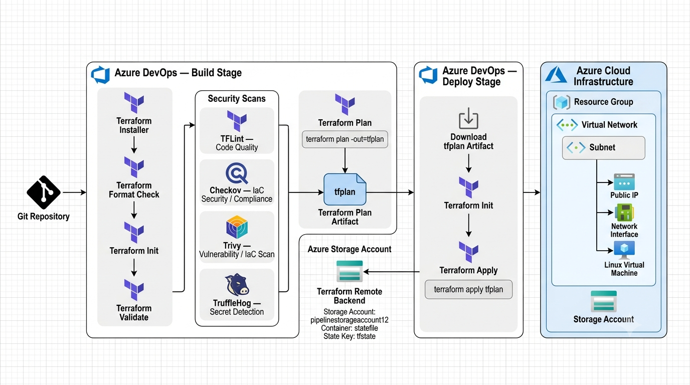

# 🚀 Azure Infrastructure as Code (IaC) & DevSecOps Pipeline

[](https://dev.azure.com/)
[](https://www.terraform.io/)
[](https://azure.microsoft.com/)
[](https://github.com/)
[](https://ubuntu.com/)

An **Enterprise-Grade Infrastructure as Code (IaC)** solution designed for automated, secure, and modular Azure cloud infrastructure provisioning. Powered by **Terraform (Parent-Child Module Architecture)** and fully integrated with **Azure DevOps CI/CD Pipelines** featuring automated **DevSecOps** security scanning.

---

## 📌 Table of Contents

- [🌟 Features](#-features)
- [🏗️ Architecture Overview](#️-architecture-overview)
- [📂 Project Directory Structure](#-project-directory-structure)
- [⚙️ Infrastructure Components](#️-infrastructure-components)
- [🛡️ DevSecOps Security Stack](#️-devsecops-security-stack)
- [🔄 CI/CD Pipeline Workflow](#-cicd-pipeline-workflow)
- [🚀 Getting Started](#-getting-started)
  - [Prerequisites](#prerequisites)
  - [Local Execution](#local-execution)
- [🔐 Remote State Management](#-remote-state-management)
- [🤝 Contributing](#-contributing)

---

## 🌟 Features

- 🧩 **Modular Terraform Architecture**: Clean separation between **Parent Module** (orchestration) and reusable **Child Modules** (resource definitions).
- ⚡ **Dynamic Resource Provisioning**: Uses Terraform `for_each` loops driven by `terraform.tfvars` for scalable, map-driven deployments.
- 🛡️ **Automated DevSecOps Pipeline**: Integrated multi-layered security checks with **TFLint**, **Checkov**, **Trivy**, and **TruffleHog**.
- ☁️ **Azure Remote State Backend**: Secure state locking and storage in Azure Blob Storage.
- 🔄 **Automated CI/CD Pipeline**: Two-stage Azure DevOps pipeline with artifact publishing and automated deployment.

---

## 🏗️ Architecture Overview

The following architecture illustrates the complete Terraform-based DevSecOps workflow, including Azure DevOps Build and Deploy stages, security scanning, Terraform plan artifact management, remote state storage, and Azure infrastructure provisioning.

<p align="center">
  
</p>

---

## 📂 Project Directory Structure

```text
Infra-pipeline/
├── 📄 README.md                 # Project documentation
├── 📄 .tflint.hcl               # TFLint configuration file
├── ⚙️ azure-pipelines.yml       # Azure DevOps CI/CD & DevSecOps Pipeline
├── 📁 Parent Module/            # Orchestration layer & variable values
│   ├── 📄 main.tf               # Invokes child modules & dependencies
│   ├── 📄 provider.tf           # Terraform & AzureRM provider configuration + Remote Backend
│   ├── 📄 variable.tf           # Input variable declarations
│   └── 📄 terraform.tfvars      # Environment-specific configuration data
└── 📁 Child Module/             # Reusable Terraform resource modules
    ├── 📁 azurerm_resource_group/   # Resource Group module
    ├── 📁 azurerm_storage_account/  # Storage Account module
    ├── 📁 azurerm_virtual_network/  # Virtual Network (VNet) module
    ├── 📁 azurerm_subnet/           # Subnet module
    ├── 📁 azurerm_public_ip/        # Public IP module
    ├── 📁 azurerm_nic/              # Network Interface Card (NIC) module
    └── 📁 azurerm_virtual_machine/  # Virtual Machine (VM) module
```

---

## ⚙️ Infrastructure Components

The project provisions the following Azure resources:

| Resource Type       | Module Path                            | Description                                    |
| :------------------ | :------------------------------------- | :--------------------------------------------- |
| **Resource Group**  | `Child Module/azurerm_resource_group`  | Logical container for Azure resources          |
| **Storage Account** | `Child Module/azurerm_storage_account` | Azure Blob / File storage account              |
| **Virtual Network** | `Child Module/azurerm_virtual_network` | Isolated virtual network (`10.0.0.0/16`)       |
| **Subnet**          | `Child Module/azurerm_subnet`          | Network subnet allocation (`10.0.1.0/24`)      |
| **Public IP**       | `Child Module/azurerm_public_ip`       | Static public IP address allocation            |
| **NIC Card**        | `Child Module/azurerm_nic`             | Network interface linking Subnet and Public IP |
| **Virtual Machine** | `Child Module/azurerm_virtual_machine` | Linux Compute VM (Ubuntu Pro 24.04 LTS)        |

---

## 🛡️ DevSecOps Security Stack

Security is baked directly into the CI/CD pipeline. Every pull request/commit triggers a battery of scans:

```
## 🔐 DevSecOps Security Pipeline

| 🛠️ Tool | 🎯 Purpose |
|---|---|
| **TFLint** | Terraform linter that detects errors, deprecated syntax, and bad practices |
| **Checkov** | Static analysis tool for identifying security and compliance issues in IaC |
| **Trivy** | Security scanner for detecting IaC misconfigurations and vulnerabilities |
| **TruffleHog** | Secret scanner that detects exposed credentials, API keys, and sensitive information |

### 🔄 Security Flow

**Terraform Code → TFLint → Checkov → Trivy → TruffleHog → Terraform Plan/Apply**
```

---

## 🔄 CI/CD Pipeline Workflow

The pipeline defined in `azure-pipelines.yml` consists of two distinct stages:

### Stage 1: Build (Continuous Integration - CI)

1. **Terraform Job**:
   - Installs latest Terraform version.
   - Runs `terraform fmt` to enforce code formatting.
   - Initializes Terraform backend (`terraform init`).
   - Validates configuration (`terraform validate`).
2. **Security Scan Job**:
   - Runs TFLint, Checkov, Trivy, and TruffleHog scans in parallel/sequence.
3. **Terraform Plan Job**:
   - Generates the execution plan (`terraform plan -out=tfplan`).
   - Publishes `tfplan` as a secure Pipeline Artifact (`TerraformPlan`).

### Stage 2: Deploy (Continuous Deployment - CD)

1. **Apply Job**:
   - Downloads `TerraformPlan` artifact from the Build stage.
   - Executes `terraform apply --auto-approve tfplan` to provision resources.

---

## 🚀 Getting Started

### Prerequisites

- [Terraform](https://www.terraform.io/downloads) (>= 1.5.0)
- [Azure CLI](https://docs.microsoft.com/en-us/cli/azure/install-azure-cli)
- An active **Azure Subscription**
- **Azure DevOps** Service Connection (`azure cloud connection`)

### Local Execution

To run and test the modules locally on your machine:

1. **Clone the repository**:

   ```bash
   git clone <repository-url>
   cd Infra-pipeline/"Parent Module"
   ```

2. **Login to Azure**:

   ```bash
   az login
   ```

3. **Initialize Terraform**:

   ```bash
   terraform init \
     -backend-config="storage_account_name=<your_storage_account>" \
     -backend-config="container_name=<your_container_name>" \
     -backend-config="key=tfstate"
   ```

4. **Format & Validate**:

   ```bash
   terraform fmt
   terraform validate
   ```

5. **Generate Execution Plan**:

   ```bash
   terraform plan
   ```

6. **Apply Infrastructure Changes**:
   ```bash
   terraform apply
   ```

---

## 🔐 Remote State Management

Terraform backend state is managed remotely in Azure Blob Storage for consistency and team collaboration:

- **Resource Group**: `Pipeline_Resource_Group`
- **Storage Account**: `pipelinestorageaccount12`
- **Container Name**: `statefile`
- **State File Key**: `tfstate`

---

## 🤝 Contributing

1. Fork the repository
2. Create a feature branch (`git checkout -b feature/AmazingFeature`)
3. Commit your changes (`git commit -m 'Add some AmazingFeature'`)
4. Run local linting & security scans (`tflint`, `checkov`, `trivy`, `trufflehog`)
5. Push to the branch (`git push origin feature/AmazingFeature`)
6. Open a Pull Request

---

<p align="center">
  Made with ❤️ for Azure Infrastructure Automation & DevSecOps Excellence.
</p>
